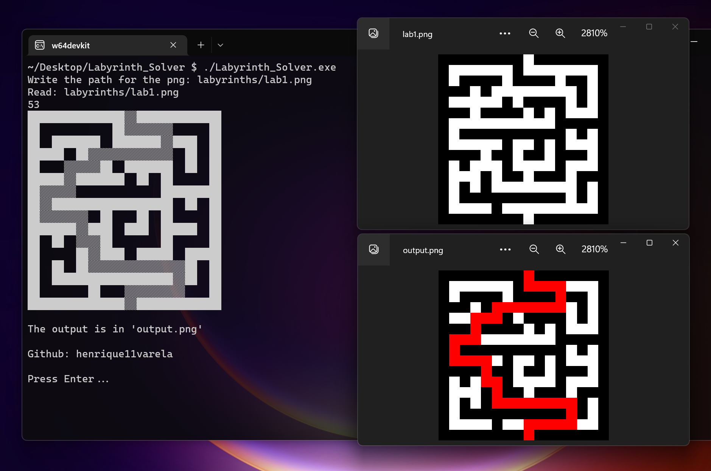

# Projects

[Back](./README.md)

## Personal projects

### Unbeatable TicTacToe  

### Labyrinth_Solver_Online

### img_particle_ball

### Conways_Game_of_Life

### WebTriad_to_String

### PNG_to_Bitmap

### Bouncing Balls OOP

### Dummy_Txt_File_Maker

### Portfolio

### Labyrinth_Solver

## School projects

### Fruit store in c++

### Recipe website

### Musicplayer_VanillaJS

