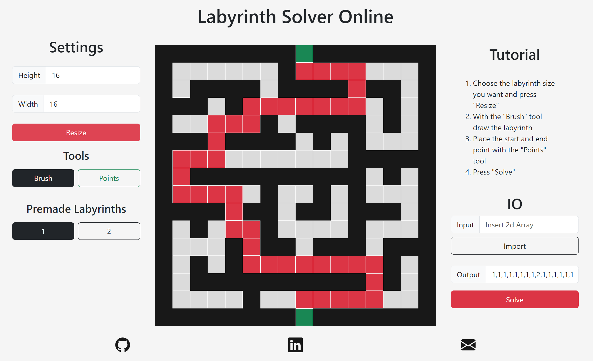
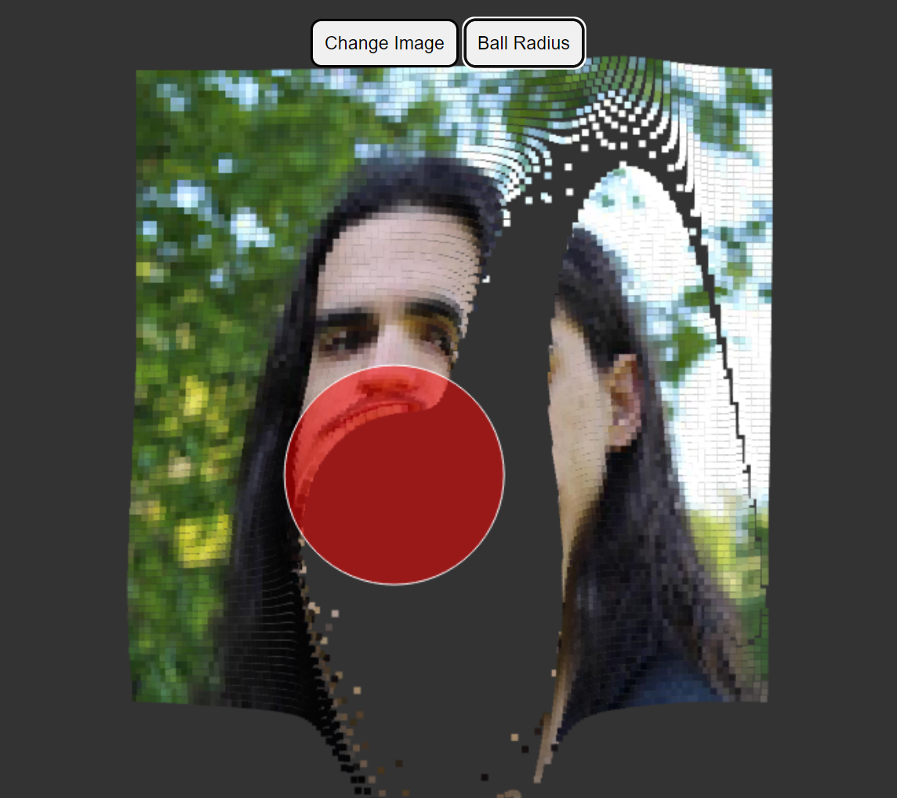

 

 

  

<h1 align="center">About me</h1>

- Hello there, I’m Henrique Varela (@henrique11varela).
- Selftaught programmer until now, studying a Programing Course at ATEC.
- I'm interested in web development, micro controllers and gamedev.
- to reach me use my [LinkedIn](https://www.linkedin.com/in/henrique-varela/)

  

<h1 align="center">Certifications</h1>

- [Cambridge English 2014](https://i.imgur.com/sADWAkY.png)
- [FreeCodeCamp Responsive Web Design](https://www.freecodecamp.org/certification/henrique_varela/responsive-web-design)
- [FreeCodeCamp JavaScript Algorithms and Data Structures](https://www.freecodecamp.org/certification/henrique_varela/javascript-algorithms-and-data-structures)

---

<h1 align="center">Project showcase</h1>

  <a href="https://henrique11varela.github.io/UnbeatableTicTacToeJS/">
    Unbeatable TicTacToe  
    
  </a>
   
   
  <a href="https://henrique11varela.github.io/Labyrinth_Solver_Online/">
    Labyrinth_Solver_Online  
    
  </a>
   
   
  <a href="https://henrique11varela.github.io/img_particle_ball/">
    img_particle_ball  
    
  </a>
   
   
  <a href="https://github.com/henrique11varela/PNG_to_Bitmap">
    PNG_to_Bitmap   
    
  </a>
   
   
  <a href="https://henrique11varela.github.io/Conways_Game_of_Life/">
    Conways_Game_of_Life   
    
  </a>
   
   
  <a href="https://editor.p5js.org/henrique11varela/full/HoJUcA-iM">
    Bouncing Balls OOP  
    
  </a>
   
   
  <a href="https://github.com/henrique11varela/Dummy_Txt_File_Maker">
    Dummy_Txt_File_Maker   
    
  </a>
   
   
  <a href="https://henrique11varela.github.io/">
    Portfolio  
    
  </a>
   
   
  <a href="https://github.com/henrique11varela/Labyrinth_Solver">
    Labyrinth_Solver  
    
  </a>
   
   

---

<h1 align="center">School projects</h1>

  <a href="https://github.com/henrique11varela/atec-t1-loja">
    Fruit store in c++  
    
  </a>
   
   
  <a href="https://github.com/henrique11varela/Marialface">
    Recipe website  
    
  </a>
   
   

---

<h1 align="center">Learning resources used</h1>

- [Khan Academy](https://www.khanacademy.org/computing/computer-programming)
- [Sololearn](https://www.sololearn.com/)
- [FreeCodeCamp](https://www.freecodecamp.org/)
- Youtube
  - [The Coding Train](https://www.youtube.com/channel/UCvjgXvBlbQiydffZU7m1_aw)
  - [Kevin Powell](https://www.youtube.com/@KevinPowell)
  - [Sebastian Lague](https://www.youtube.com/@SebastianLague)
  - [MIT OpenCourseWare](https://www.youtube.com/@mitocw)
  - [Paul McWhorter](https://www.youtube.com/@paulmcwhorter)

## Other

